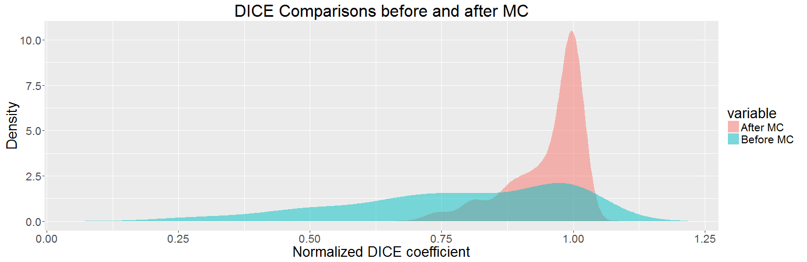
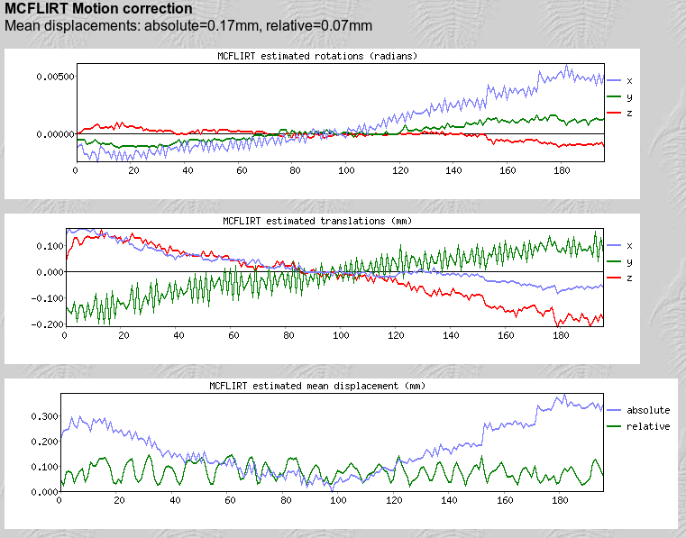
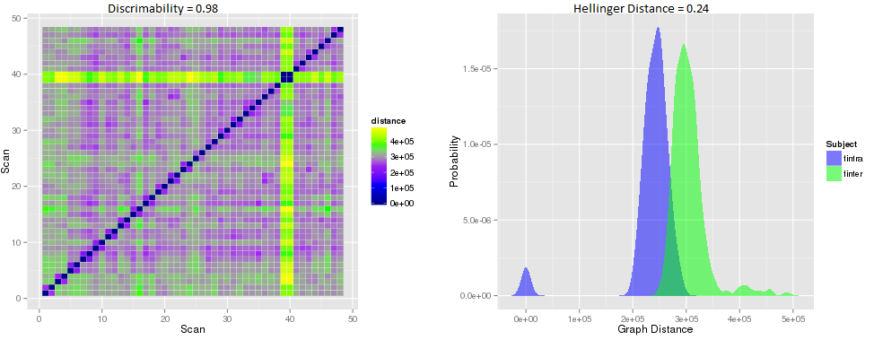

## Progress Report - June 6, 2016
**Table of Contents:**
- [Pipeline](./progress_67.md#pipeline)
  - [Raw Data](./progress_67.md#raw-data)
  - [Motion Correction](./progress_67.md#motion-correction)
    - [Motion Correction QC](./progress_67.md#motion-correction-quality-control)
  - [Registration](./progress_67.md#registration)
    - [Registration QC](./progress_67.md#registration-quality-control)
  - [Voxel Timeseries Extraction](./progress_67.md#voxel-timeseries-extraction)
  - [Downsampling](./progress_67.md#downsampling)
    - [Downsampling Quality Control](./progress_67.md#downsampling-quality-control)
  - [Overall Pipeline QC](./progress_67.md#overall-pipeline-quality-control)
    
----------
## Pipeline

### Raw Data

The raw data to be processed by this leg of the pipeline is fMRI functional scans, and registration will require MPRAGE anatomical scans.

### Motion Correction

Motion Correction will be performed using mcFLIRT, the motion correction module as a part of FSL's Linear Registration Tool. We will default to using the 0th 3d volume for all alignment (assume that the 0th volume corresponds to our true rotational and translational x, y, and z positions). Note that eddy correction is not possible for fMRI images (command line error for invalid data type). TODO: explore using the mean volume instead of the 0th volume later.

##### Motion Correction Quality Control

deliverable 1: a plot of each mc'd (motion corrected) 3d volume (1 volume for each time point, total of [numtimepoints] images per subject) overlapped with the same slice of the 0th volume. The left column will be before mc; the right after mc. The number of rows will be the same as the number of slices in each 3d volume. The title of each plot will be the DICE score between the two shown images (each image will be opaque). 

deliverable 2: a collection of all of the DICE scores for the previous deliverable, in a separate array for each condition (before or after mc). Each condition will then have a kde estimated for the density with respect to the DICE score. Theoretically, we will see a better DICE score on average for the volumes after mc, and the hellinger distance between the two conditions' kdes will be shown as the title.

deliverable 3: a plot of the 6 parameters used by mcFLIRT for mc (rotational and translational x, y, and z) as a function of time (6 lines, 1 for each parameter). The bottom plot will show overall translational and rotational displacement as a function of time (2 lines, 1 for translational and 1 for rotational). 

### Registration

Registration will be completed using the same procedure as the DTI processing pipeline leg of ndmg. We will first align the fMRI 0th scan to the MPRAGE image, and then the MPRAGE image to the template brain (MNI152). We will then combine those two transformations and apply the new robust transformation to the fMRI volume stack, thus giving us the fMRI brain in the template space.

##### Registration Quality Control

deliverable 1: a plot of each registered 3d volume (1 volume for each time point, total of [numtimepoints] images per subject) overlapped this time with the same slice of the template brain. The left column will be before registration, the right column after registration. The number of rows will be the number of slices in each 3d volume. The title of each plot will be the DICE score between the two images.

deliverable 2: a collection of all the DICE scores for the previous deliverable, in a separate array for each condition (before and after registration). Each condition will then have a kde estimated for the density with respect to the DICE score. Theoretically, we will see a better DICE score on average for the volumes after registration, and the hellinger distance between the two conditions' kdes will be shown as the title.

### Voxel Timeseries Extraction

Voxel Timeseries Extraction will be performed using the MNI152 template brain mask. We will extract timeseries for all voxels in the brain mask for all time points, to produce a timeseries for each fMRI brain of dimensions [numvoxels] x [numtimepoints]. 

### Downsampling

Downsampling will be performed using a labelled atlas. We will average the timeseries for all of the voxels within each roi, to produce a timeseries for each fMRI brain of dimensions [numrois] x [numtimepoints] per labelled atlas.

##### Downsampling Quality Control

deliverable 1: a correlation matrix for a single fMRI brain.

### Overall Pipeline Quality Control

The pipeline will be run on an entire dataset, KKI21, and derivatives/individual QC metrics collected prior to performing overall pipeline QC. 

deliverable 1: a plot showing the distance matrix between the scans of the dataset, with title as discriminability. 

deliverable 2: a plot showing the kdes respectively for intra vs inter subject graph distances, collected from the previous distance matrix. Goal is to show that intra subject distances are less than inter subject distances, a characteristic of discriminability. Title will be the hellinger distance between the two conditions.

